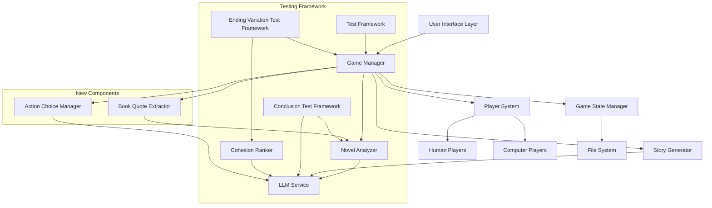

# Design Document: Game Improvements

## Overview

This design enhances the Novel RPG Game system with three major improvements: (1) enhanced game state logging that displays character names alongside player numbers for better readability, (2) a test framework for validating the LLM's ability to correctly identify book conclusions with consistency scoring, and (3) a test framework for comparing story cohesion across different ending variations (original, opposite, random) using short 5-round games. Additionally, the design introduces a player action choice system where players select from generated options, book quote integration for authentic dialogue, contextual dialogue grouping, and comprehensive code cleanup.

## Architecture

The system extends the existing modular architecture with new testing components and enhanced game flow:



## Components and Interfaces

### Enhanced Game Manager

The GameManager is extended to support character name logging and the new action choice system.

**Modified Interface:**
```typescript
interface GameManager {
  // Existing methods
  startGame(novelFile: string, humanPlayers: number, rounds: number, allowZeroHumans?: boolean, preAnalyzedNovel?: NovelAnalysis): Promise<GameSession>
  validateInput(novelFile: string, humanPlayers: number, rounds: number, allowZeroHumans?: boolean): ValidationResult
  processPlayerTurn(playerId: string, action: PlayerAction): Promise<StorySegment>
  
  // Enhanced methods
  processPlayerTurnWithChoice(playerId: string): Promise<StorySegment> // NEW
  getPlayerDisplayName(playerId: string): string // NEW
}
```

**Implementation Notes:**
- `getPlayerDisplayName()` returns "Character Name (Player X)" or "Player X" if no character assigned
- `processPlayerTurnWithChoice()` generates both talk and act options, presents them, and processes the selected choice
- All logging methods updated to use `getPlayerDisplayName()`

### Book Quote Extractor

New component responsible for extracting authentic dialogue and narrative from the source novel, with intelligent ending compatibility checking.

**Interface:**
```typescript
interface BookQuoteExtractor {
  extractCharacterDialogue(character: Character, context?: DialogueContext, targetEnding?: StoryEnding): Promise<string[]>
  extractCharacterActions(character: Character, context?: DialogueContext, targetEnding?: StoryEnding): Promise<string[]>
  findDialogueContext(round: number, totalRounds: number): Promise<DialogueContext>
  validateQuoteForCharacter(quote: string, character: Character): boolean
  checkEndingCompatibility(quote: string, targetEnding: StoryEnding): Promise<CompatibilityScore> // NEW
  shouldUseBookQuote(quotePercentage: number, targetEnding: StoryEnding, endingType: string): boolean // NEW
}

interface DialogueContext {
  startPosition: number
  endPosition: number
  chapterNumber?: number
  sceneDescription: string
  availableCharacters: string[]
}

interface CompatibilityScore {
  score: number // 0-10, how well quote supports target ending
  reasoning: string
  shouldUse: boolean // Whether to use this quote given the target ending
}
```

**Implementation Strategy:**
- Use novel analysis to identify character dialogue patterns
- Extract quotes using regex and NLP techniques
- Maintain context windows for scene coherence
- Cache extracted quotes for performance
- **NEW: Check ending compatibility before using quotes**
- **NEW: Automatically reduce quote usage for non-original endings**
- **NEW: Mark all content as either "Book Quote" or "LLM Generated"**

### Action Choice Manager

New component that generates action options and manages player selection.

**Interface:**
```typescript
interface ActionChoiceManager {
  generateActionOptions(player: Player, gameContext: GameContext): Promise<ActionOptions>
  presentOptionsToPlayer(player: Player, options: ActionOptions): Promise<PlayerChoice>
  applyPlayerChoice(choice: PlayerChoice, gameContext: GameContext): Promise<StorySegment>
}

interface ActionOptions {
  talkOption: string
  actOption: string
  doNothingOption: string
}

interface PlayerChoice {
  selectedAction: 'talk' | 'act' | 'nothing'
  selectedContent: string
  timestamp: Date
}
```

**Implementation Strategy:**
- Generate both talk and act options using LLM
- For human players: display options and wait for selection
- For computer players: randomly select from three options
- Apply book quote percentage when generating options
- **NEW: Check ending compatibility before using book quotes**
- **NEW: Clearly mark content source in display**

### Quote Selection Strategy

The system uses an intelligent quote selection strategy that balances authenticity with narrative coherence:

**Quote Usage Decision Tree:**
```
1. Check configured quote percentage (e.g., 60%)
2. If target ending is "original":
   - Use book quotes at configured percentage
   - Quotes naturally support the original ending
3. If target ending is "opposite" or "random":
   - Extract potential book quote
   - Check ending compatibility using LLM
   - If compatibility score < 5/10:
     - Use LLM-generated content instead
     - Increment endingCompatibilityAdjustments counter
   - If compatibility score >= 5/10:
     - Use book quote
4. Mark content source clearly:
   - "Book Quote" with chapter/page reference
   - "LLM Generated" with no reference
```

**Effective Quote Percentage:**
- **Original ending**: Effective ≈ Configured (e.g., 60% → 58-62%)
- **Opposite ending**: Effective < Configured (e.g., 60% → 20-40%)
- **Random ending**: Effective < Configured (e.g., 60% → 30-50%)

**Display Format:**
```
[Book Quote - Chapter 15]
Elizabeth said, "I am determined that only the deepest love will induce me into matrimony."

[LLM Generated]
Elizabeth considered her options carefully, knowing that her decision would affect not only herself but her entire family.
```

**Rationale:**
- Maintains authenticity when possible
- Ensures narrative coherence toward target ending
- Provides transparency about content source
- Allows users to understand why quote usage varies
- Tracks adjustments for analysis and reporting

### Conclusion Test Framework

New testing component for validating book conclusion identification.

**Interface:**
```typescript
interface ConclusionTestFramework {
  runConclusionTest(config: ConclusionTestConfig): Promise<ConclusionTestReport>
  analyzeConclusionConsistency(conclusions: string[]): ConsistencyScore
  scoreConclusionQuality(conclusion: string, bookConclusion: string): QualityScores
}

interface ConclusionTestConfig {
  novelFile: string
  iterations: number // 1-10
  outputDirectory: string
}

interface ConclusionTestReport {
  iterations: ConclusionIteration[]
  consistencyScore: number // 0-10
  averageAccuracy: number // 0-10
  averageCompleteness: number // 0-10
  averageCoherence: number // 0-10
  generatedAt: Date
}

interface ConclusionIteration {
  iterationNumber: number
  conclusionText: string
  accuracyScore: number // 1-10
  completenessScore: number // 1-10
  coherenceScore: number // 1-10
  wordCount: number
  keyElements: string[]
}

interface ConsistencyScore {
  score: number // 0-10
  similarityMatrix: number[][] // Pairwise similarity scores
  outliers: number[] // Iteration numbers that differ significantly
}

interface QualityScores {
  accuracy: number // 1-10
  completeness: number // 1-10
  coherence: number // 1-10
  reasoning: string
}
```

**Implementation Strategy:**
- Run novel analysis N times (configurable iterations)
- Extract conclusion from each analysis
- Use LLM to score each conclusion for accuracy, completeness, coherence
- Calculate pairwise similarity using cosine similarity or LLM comparison
- Flag outliers that differ significantly from the mean
- Generate reports in CSV, JSON, and text table formats

### Ending Variation Test Framework

New testing component for comparing different ending types.

**Interface:**
```typescript
interface EndingVariationTestFramework {
  runEndingVariationTest(config: EndingVariationTestConfig): Promise<EndingVariationReport>
  generateOriginalEnding(analysis: NovelAnalysis): Promise<StoryEnding>
  generateOppositeEnding(analysis: NovelAnalysis): Promise<StoryEnding>
  generateRandomEnding(analysis: NovelAnalysis): Promise<StoryEnding>
}

interface EndingVariationTestConfig {
  novelFile: string
  rounds: number // Fixed at 5 for quick testing
  outputDirectory: string
  quotePercentage: number // 0-100
}

interface EndingVariationReport {
  originalEndingGame: GameResult
  oppositeEndingGame: GameResult
  randomEndingGame: GameResult
  comparison: EndingComparison
  generatedAt: Date
}

interface EndingComparison {
  highestCohesion: 'original' | 'opposite' | 'random'
  cohesionScores: {
    original: number
    opposite: number
    random: number
  }
  averageWordCount: {
    original: number
    opposite: number
    random: number
  }
  quoteUsageStats: {
    original: QuoteUsageStats
    opposite: QuoteUsageStats
    random: QuoteUsageStats
  }
}

interface QuoteUsageStats {
  totalActions: number
  bookQuotesUsed: number
  llmGeneratedUsed: number
  actualPercentage: number
}
```

**Implementation Strategy:**
- Analyze novel once, reuse for all three games
- Generate three distinct endings:
  - **Original**: Extract and use the book's actual conclusion
  - **Opposite**: Invert the outcome (happy → tragic, success → failure, etc.)
  - **Random**: Generate a creative alternative unrelated to the book
- Run three separate 5-round games, one per ending type
- Apply book quote integration and dialogue grouping
- Analyze cohesion for each game
- Generate comparative reports showing which ending type produces best cohesion

## Data Models

### Enhanced Story Segment

```typescript
interface StorySegment {
  content: string
  wordCount: number
  generatedBy: PlayerAction
  targetEnding: string
  timestamp: Date
  characterName: string // NEW: Character who performed the action
  playerId: string // NEW: Player ID for reference
  contentSource: 'book_quote' | 'llm_generated' // NEW: Clear marking of source
  dialogueContext?: DialogueContext // NEW: Book section if quote used
  bookQuoteMetadata?: BookQuoteMetadata // NEW: Additional quote information
}

interface BookQuoteMetadata {
  originalText: string // Exact text from book
  chapterNumber?: number
  pageNumber?: number
  contextDescription: string
  endingCompatibilityScore: number // How well it supports target ending
}
```

### Enhanced Game State

```typescript
interface GameState {
  metadata: GameMetadata
  novelAnalysis: NovelAnalysis
  players: Player[]
  currentRound: number
  totalRounds: number
  storySegments: StorySegment[]
  targetEnding?: StoryEnding
  quotePercentage: number // NEW: Configured 0-100
  effectiveQuotePercentage: number // NEW: Actual percentage after ending compatibility adjustments
  quoteUsageStats: QuoteUsageStats // NEW: Track actual usage
}

interface QuoteUsageStats {
  totalActions: number
  bookQuotesUsed: number
  llmGeneratedUsed: number
  configuredPercentage: number
  actualPercentage: number
  endingCompatibilityAdjustments: number // How many times quotes were rejected due to ending incompatibility
}
```

### Enhanced Player Action

```typescript
interface PlayerAction {
  type: 'talk' | 'act' | 'nothing'
  timestamp: Date
  playerId: string
  characterName?: string // NEW: Character name for display
  selectedFrom?: ActionOptions // NEW: Options that were presented
  contentSource: 'book_quote' | 'llm_generated' // NEW: Clear marking of source
  bookQuoteMetadata?: BookQuoteMetadata // NEW: If book quote, include metadata
}
```

## Correctness Properties

*A property is a characteristic or behavior that should hold true across all valid executions of a system—essentially, a formal statement about what the system should do. Properties serve as the bridge between human-readable specifications and machine-verifiable correctness guarantees.*

### Property 1: Character Name Inclusion
*For any* story segment, game event, or game state file, if a player has an assigned character, the output should include both the character name and player ID in a consistent format.
**Validates: Requirements 1.1, 1.2, 1.3**

### Property 2: Conclusion Test Iteration Count
*For any* conclusion test configuration with N iterations, the system should perform exactly N novel analyses and produce exactly N conclusion results.
**Validates: Requirements 2.1, 2.2**

### Property 3: Conclusion Consistency Scoring
*For any* set of conclusions from multiple iterations, the consistency score should be between 0 and 10, with higher scores indicating more similar conclusions.
**Validates: Requirements 2.3, 2.6**

### Property 4: Conclusion Quality Scoring Range
*For any* conclusion quality assessment, all three scores (accuracy, completeness, coherence) should be between 1 and 10 inclusive.
**Validates: Requirements 2.4**

### Property 5: Multi-Format Report Generation
*For any* completed test run (conclusion or ending variation), the system should generate reports in all three formats (CSV, JSON, text table) with consistent data across formats.
**Validates: Requirements 2.5, 3.7**

### Property 6: Ending Type Distinctness
*For any* ending variation test, the three generated endings (original, opposite, random) should be semantically distinct from each other, with the opposite ending having inverted outcome from the original.
**Validates: Requirements 3.1, 3.2, 3.3, 3.4**

### Property 7: Fixed Round Count for Variation Tests
*For any* ending variation test, exactly three games should be executed, each with exactly 5 rounds (or the configured round count).
**Validates: Requirements 3.5**

### Property 8: Cohesion Score Calculation
*For any* completed game in an ending variation test, a cohesion score between 1 and 10 should be calculated and included in the results.
**Validates: Requirements 3.6**

### Property 9: Comparative Statistics Accuracy
*For any* ending variation report, the comparative statistics should correctly identify which ending type achieved the highest cohesion score.
**Validates: Requirements 3.8**

### Property 10: Individual Game State Files
*For any* ending variation test, exactly three game state files should be created, one for each ending type, with unique filenames.
**Validates: Requirements 3.9**

### Property 11: Configuration Parameter Validation
*For any* test configuration, the system should validate that iteration counts are between 1-10, round counts are between 1-20, and quote percentages are between 0-100, rejecting invalid values.
**Validates: Requirements 4.1, 4.2, 4.3, 4.4**

### Property 12: Action Option Generation
*For any* player turn, the system should generate both a talk option and an act option before prompting for player choice.
**Validates: Requirements 11.1, 11.3**

### Property 13: Action Choice Recording
*For any* player selection, the system should record which action was chosen (talk, act, or nothing) and apply the corresponding game logic.
**Validates: Requirements 11.4**

### Property 14: Random Action Selection in Tests
*For any* computer player turn in automated tests, the selected action should be one of the three valid options (talk, act, nothing) chosen randomly.
**Validates: Requirements 11.5**

### Property 15: Do Nothing Round Increment
*For any* "do nothing" action, the total round count should increase by exactly 1.
**Validates: Requirements 11.6**

### Property 16: Quote Percentage Configuration
*For any* game initialization, the game state should include a quote percentage parameter between 0 and 100.
**Validates: Requirements 12.1**

### Property 17: Book Quote Usage with Ending Compatibility
*For any* large sample of generated actions (N > 100), the actual percentage of book quotes used should be within ±10% of the configured quote percentage, but should automatically reduce when quotes don't support the target ending.
**Validates: Requirements 12.2, 12.3**

### Property 18: Quote Character Matching
*For any* book quote used in the game, the quote should be verifiable as appearing in the source novel and associated with the correct character.
**Validates: Requirements 12.4**

### Property 19: Quote Fallback Behavior
*For any* situation where no suitable book quote is found for a character, the system should fall back to LLM-generated content without error.
**Validates: Requirements 12.7**

### Property 20: Dialogue Context Identification
*For any* round in the game, the system should identify a dialogue context section from the source novel before extracting quotes.
**Validates: Requirements 13.1**

### Property 21: Contextual Quote Grouping
*For any* round where multiple characters use book quotes, the quotes should preferably come from the same or nearby sections of the book (within the same chapter or scene).
**Validates: Requirements 13.2, 13.3**

### Property 22: Context Expansion Fallback
*For any* dialogue context that doesn't contain quotes for all characters, the system should either expand the context or use LLM-generated content without failing.
**Validates: Requirements 13.4**

### Property 23: Turn Display Format Consistency
*For any* player turn selection, the display format should be "Character_Name (Player X) chose: [action]" when a character is assigned, or "Player X chose: [action]" when no character is assigned.
**Validates: Requirements 14.1, 14.2, 14.3**

### Property 24: API Compatibility Preservation
*For any* public API method, after code cleanup, the method signature and behavior should remain unchanged to maintain backward compatibility.
**Validates: Requirements 15.5**

### Property 25: Content Source Transparency
*For any* story segment or player action, the content source should be clearly marked as either "book_quote" or "llm_generated", with book quotes including chapter/page metadata when available.
**Validates: Requirements 12.2, 12.3, 12.4**

### Property 26: Ending Compatibility Adjustment
*For any* game targeting a non-original ending (opposite or random), the effective quote percentage should be lower than the configured percentage due to ending compatibility filtering, and this adjustment should be tracked in game statistics.
**Validates: Requirements 3.2, 3.3, 3.4, 12.2, 12.3**

## Error Handling

### Character Name Display Errors
- **Missing character assignment**: Display player ID only without parentheses
- **Null character name**: Fall back to player ID
- **Character assignment race condition**: Use player ID until character is assigned

### Book Quote Extraction Errors
- **No quotes found for character**: Fall back to LLM-generated content
- **Quote extraction timeout**: Use LLM-generated content
- **Invalid quote format**: Validate and retry or fall back to LLM
- **Character mismatch**: Re-extract or use LLM-generated content

### Action Choice Errors
- **LLM fails to generate options**: Retry with simpler prompt or use fallback templates
- **Player timeout on selection**: For human players, prompt again; for computer players, select randomly
- **Invalid selection**: Prompt again with validation message

### Conclusion Test Errors
- **Analysis failure on iteration**: Log error, continue with remaining iterations
- **Scoring failure**: Use default scores and flag in report
- **Consistency calculation failure**: Report error but continue with other metrics

### Ending Variation Test Errors
- **Ending generation failure**: Retry with different prompt or use fallback ending
- **Game execution failure**: Log error, continue with remaining games
- **Cohesion analysis failure**: Use default score and flag in report

### Configuration Errors
- **Invalid quote percentage**: Clamp to 0-100 range with warning
- **Invalid iteration count**: Clamp to 1-10 range with warning
- **Invalid round count**: Clamp to 1-20 range with warning
- **Missing output directory**: Create directory or use default

## Testing Strategy

The testing approach combines traditional unit testing with property-based testing to ensure both specific functionality and universal correctness properties.

### Unit Testing

**Character Name Display:**
- Test `getPlayerDisplayName()` with assigned character
- Test `getPlayerDisplayName()` without assigned character
- Test story segment includes character name
- Test game state file includes character names

**Book Quote Extraction:**
- Test quote extraction for known character
- Test fallback when no quotes found
- Test quote validation against source text
- Test dialogue context identification

**Action Choice System:**
- Test option generation for player turn
- Test human player selection flow
- Test computer player random selection
- Test "do nothing" round increment

**Conclusion Test Framework:**
- Test multiple iterations execute correctly
- Test conclusion extraction from analysis
- Test consistency scoring calculation
- Test report generation in all formats

**Ending Variation Test Framework:**
- Test original ending matches book
- Test opposite ending inverts outcome
- Test random ending is distinct
- Test three games execute with correct rounds
- Test comparative report generation

### Property-Based Testing

Property-based tests will validate universal properties using fast-check for TypeScript. Each test will run a minimum of 100 iterations and be tagged with references to design properties.

**Configuration:**
- **Library**: fast-check for TypeScript
- **Iterations**: Minimum 100 per property test
- **Tagging format**: `// Feature: game-improvements, Property {number}: {property_text}`

**Test Generators:**
- **Player generator**: Random players with/without characters
- **Game state generator**: Random valid game states
- **Configuration generator**: Random valid test configurations
- **Quote percentage generator**: Random values 0-100
- **Action generator**: Random talk/act/nothing actions

**Property Test Examples:**

```typescript
// Feature: game-improvements, Property 1: Character Name Inclusion
test('Character names appear in all outputs when assigned', () => {
  fc.assert(
    fc.property(
      fc.record({
        playerId: fc.string(),
        characterName: fc.option(fc.string(), { nil: undefined })
      }),
      (player) => {
        const displayName = getPlayerDisplayName(player.playerId, player.characterName);
        if (player.characterName) {
          return displayName.includes(player.characterName) && 
                 displayName.includes(player.playerId);
        } else {
          return displayName === `Player ${player.playerId}` &&
                 !displayName.includes('(');
        }
      }
    ),
    { numRuns: 100 }
  );
});

// Feature: game-improvements, Property 17: Book Quote Usage Probability
test('Book quote usage matches configured percentage', async () => {
  fc.assert(
    fc.asyncProperty(
      fc.integer({ min: 0, max: 100 }),
      async (quotePercentage) => {
        const sampleSize = 200;
        let bookQuoteCount = 0;
        
        for (let i = 0; i < sampleSize; i++) {
          const action = await generateAction(quotePercentage);
          if (action.isBookQuote) bookQuoteCount++;
        }
        
        const actualPercentage = (bookQuoteCount / sampleSize) * 100;
        const tolerance = 10; // ±10%
        
        return Math.abs(actualPercentage - quotePercentage) <= tolerance;
      }
    ),
    { numRuns: 20 } // Fewer runs due to async and sample size
  );
});
```

### Integration Testing

**End-to-End Game Flow:**
- Run complete game with character name display
- Run complete game with book quote integration
- Run complete game with action choice system
- Verify all features work together

**Test Framework Integration:**
- Run conclusion test on small novel
- Run ending variation test on small novel
- Verify reports are generated correctly
- Verify all metrics are calculated

**Pride and Prejudice Comprehensive Test:**
- Run ending variation test with all features enabled
- Verify original ending matches book
- Verify opposite ending inverts outcome
- Verify random ending is creative
- Verify book quotes are used correctly
- Verify dialogue grouping works
- Verify comparative reports are accurate

## Performance Considerations

### Book Quote Extraction
- **Caching**: Cache extracted quotes to avoid repeated extraction
- **Indexing**: Build character dialogue index during novel analysis
- **Lazy loading**: Extract quotes on-demand rather than all at once
- **Timeout**: Set reasonable timeouts for quote extraction (5 seconds)

### Action Option Generation
- **Parallel generation**: Generate talk and act options in parallel
- **Caching**: Cache generated options for similar contexts
- **Timeout**: Set timeout for LLM generation (10 seconds)

### Conclusion Testing
- **Sequential execution**: Run iterations sequentially to avoid rate limits
- **Delays**: Add delays between iterations (10 seconds)
- **Resource cleanup**: Clean up after each iteration

### Ending Variation Testing
- **Novel analysis reuse**: Analyze novel once, reuse for all three games
- **Parallel games**: Consider running games in parallel if rate limits allow
- **Delays**: Add delays between games (30 seconds)

## Implementation Sequence

### Phase 1: Character Name Display (Requirements 1, 14)
1. Add `characterName` field to `StorySegment`
2. Implement `getPlayerDisplayName()` helper method
3. Update `processPlayerTurn()` to include character name
4. Update all logging to use `getPlayerDisplayName()`
5. Update game state file formatting
6. Test with existing games

### Phase 2: Book Quote Extraction (Requirements 12, 13)
1. Create `BookQuoteExtractor` component
2. Implement character dialogue extraction
3. Implement dialogue context identification
4. Implement quote validation
5. Add quote percentage configuration to game state
6. Integrate with story generation
7. Test quote extraction and fallback

### Phase 3: Action Choice System (Requirement 11)
1. Create `ActionChoiceManager` component
2. Implement option generation (talk and act)
3. Implement player selection flow
4. Update test framework for random selection
5. Integrate with game manager
6. Test human and computer player flows

### Phase 4: Conclusion Test Framework (Requirement 2)
1. Create `ConclusionTestFramework` class
2. Implement multiple iteration execution
3. Implement conclusion extraction
4. Implement consistency scoring using LLM
5. Implement quality scoring (accuracy, completeness, coherence)
6. Implement report generation (CSV, JSON, text)
7. Create CLI script
8. Test with small novel

### Phase 5: Ending Variation Test Framework (Requirements 3, 16)
1. Create `EndingVariationTestFramework` class
2. Implement original ending generation
3. Implement opposite ending generation
4. Implement random ending generation
5. Implement three-game execution with 5 rounds
6. Implement cohesion analysis for each game
7. Implement comparative report generation
8. Create CLI script
9. Test with small novel

### Phase 6: Code Cleanup (Requirement 15)
1. Remove old dice-roll-based action determination
2. Remove obsolete test code
3. Update documentation
4. Verify all tests pass
5. Verify API compatibility

### Phase 7: Comprehensive Testing (Requirement 16)
1. Run ending variation test on Pride and Prejudice
2. Verify all features work together
3. Analyze results and generate reports
4. Document findings

## Deployment Considerations

- All changes are backward compatible
- New features are opt-in via configuration
- Existing games continue to work
- New test frameworks are separate executables
- No database migrations required
- Configuration file updates are optional

## Future Enhancements

- **Quote quality scoring**: Score extracted quotes for relevance and quality
- **Multi-book testing**: Run tests across multiple novels simultaneously
- **Dialogue coherence metrics**: Measure how well grouped dialogue flows
- **Interactive quote selection**: Let players choose from multiple quote options
- **Quote attribution display**: Show book page/chapter for each quote
- **Ending quality metrics**: Measure ending quality beyond cohesion
- **Parallel test execution**: Run multiple tests in parallel with rate limiting
- **Test result visualization**: Create charts and graphs for test results
