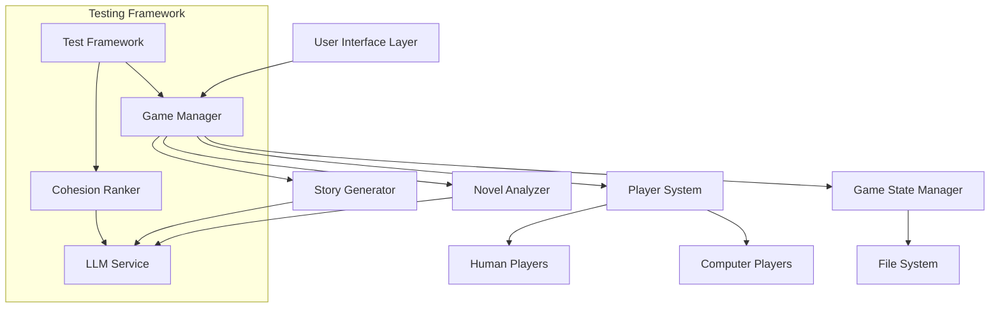

# Design Document: Novel RPG Game

## Overview

The Novel RPG Game transforms any text novel into an interactive, turn-based role-playing experience. The system leverages Large Language Models (LLMs) for novel analysis and dynamic story generation, supporting 1-4 human players with AI-controlled computer players filling remaining slots. The architecture emphasizes modularity, testability, and narrative coherence while providing both interactive gameplay and automated testing capabilities.

## Architecture

The system follows a modular, event-driven architecture with clear separation between game logic, narrative generation, and user interface components:



## Components and Interfaces

### Game Manager
The central orchestrator that coordinates all game phases and maintains the overall game flow.

**Interface:**
```typescript
interface GameManager {
  startGame(novelFile: string, humanPlayers: number, rounds: number): Promise<GameSession>
  validateInput(novelFile: string, humanPlayers: number, rounds: number): ValidationResult
  validateNovelAnalysis(analysis: NovelAnalysis): boolean
  terminateGameEarly(reason: string): void
  getCurrentPhase(): GamePhase
  processPlayerTurn(playerId: string, action: PlayerAction): Promise<StorySegment>
}
```

### Novel Analyzer
Processes input novels to extract key narrative elements using LLM analysis.

**Interface:**
```typescript
interface NovelAnalyzer {
  analyzeNovel(novelText: string): Promise<NovelAnalysis>
  extractCharacters(novelText: string): Promise<Character[]>
  extractPlotPoints(novelText: string): Promise<PlotPoint[]>
  identifyNarrativeStructure(novelText: string): Promise<NarrativeStructure>
  validateFileSize(filePath: string, maxSizeMB: number): boolean
  validateAnalysisCompleteness(analysis: NovelAnalysis): boolean
}

interface NovelAnalysis {
  mainCharacters: Character[]
  plotPoints: PlotPoint[]
  introduction: string
  climax: string
  conclusion: string
  isComplete: boolean
  validationErrors: string[]
}
```

### Story Generator
Creates dynamic narrative content and multiple story endings based on player actions.

**Interface:**
```typescript
interface StoryGenerator {
  generateEndings(analysis: NovelAnalysis): Promise<StoryEnding[]>
  generateDialogue(context: GameContext, wordCount: number): Promise<string>
  generateNarrative(context: GameContext, wordCount: number): Promise<string>
  selectTargetEnding(currentState: GameState, playerAction: PlayerAction): StoryEnding
  validateEndingGeneration(endings: StoryEnding[]): boolean
}
```

### Player System
Manages both human and computer players, handling turn mechanics and character assignments.

**Interface:**
```typescript
interface PlayerSystem {
  initializePlayers(humanCount: number): Player[]
  rollForTurnOrder(players: Player[]): Player[]
  assignCharacters(players: Player[], characters: Character[]): void
  processPlayerInput(player: Player, timeLimit: number): Promise<PlayerAction>
}

interface Player {
  id: string
  type: 'human' | 'computer'
  character?: Character
  rollDice(): number
  makeChoice(options: string[]): Promise<string>
}
```

### Game State Manager
Handles persistence and retrieval of all game data throughout the session.

**Interface:**
```typescript
interface GameStateManager {
  createGameStateFile(metadata: GameMetadata): string
  saveGameEvent(event: GameEvent): void
  loadGameState(filename: string): GameState
  appendToGameLog(content: string): void
}

interface GameState {
  metadata: GameMetadata
  novelAnalysis: NovelAnalysis
  players: Player[]
  currentRound: number
  totalRounds: number
  storySegments: StorySegment[]
  targetEnding?: StoryEnding
}
```

### LLM Service
Provides a unified interface for all LLM interactions with proper error handling and response validation. The service supports configurable LLM providers through a configuration file.

**Interface:**
```typescript
interface LLMService {
  initialize(config: LLMConfig): Promise<void>
  analyzeText(prompt: string, text: string): Promise<string>
  generateContent(prompt: string, context: any): Promise<string>
  validateResponse(response: string, expectedFormat: string): boolean
}

interface LLMConfig {
  provider: 'openai' | 'anthropic' | 'local'
  apiKey?: string
  model: string
  baseUrl?: string
  maxTokens: number
  temperature: number
  timeout: number
}
```

### Configuration Management

The system uses a configuration file to manage LLM settings and other system parameters:

```typescript
interface SystemConfig {
  llm: LLMConfig
  game: GameConfig
  testing: TestConfig
}

interface GameConfig {
  defaultRounds: number
  maxPlayers: number
  turnTimeoutSeconds: number
  gameStateDirectory: string
  maxNovelSizeMB: number
}

interface TestConfig {
  outputDirectory: string
  cohesionAnalysisModel: string
  testIterations: number
}
```

**Configuration File Format (config.json):**
```json
{
  "llm": {
    "provider": "openai",
    "model": "gpt-4",
    "apiKey": "${OPENAI_API_KEY}",
    "maxTokens": 2000,
    "temperature": 0.7,
    "timeout": 30000
  },
  "game": {
    "defaultRounds": 15,
    "maxPlayers": 4,
    "turnTimeoutSeconds": 60,
    "gameStateDirectory": "./game_states",
    "maxNovelSizeMB": 50
  },
  "testing": {
    "outputDirectory": "./test_outputs",
    "cohesionAnalysisModel": "gpt-4",
    "testIterations": 6
  }
}
```

### Core Game Entities

```typescript
interface Character {
  id: string
  name: string
  description: string
  importance: number // 1-10 ranking from novel analysis
}

interface PlotPoint {
  id: string
  description: string
  sequence: number
  importance: 'major' | 'minor'
}

interface StoryEnding {
  id: string
  type: 'original' | 'similar' | 'opposite' | 'random'
  description: string
  targetScore: number // How many actions should lead toward this ending
}

interface PlayerAction {
  type: 'talk' | 'act' | 'nothing'
  diceRoll: number
  timestamp: Date
  playerId: string
}

interface StorySegment {
  content: string
  wordCount: number
  generatedBy: PlayerAction
  targetEnding: string
  timestamp: Date
}

interface GameMetadata {
  startTime: Date
  humanPlayerCount: number
  totalRounds: number
  novelTitle: string
  filename: string
}
```

### Testing Data Models

```typescript
interface TestConfiguration {
  roundCounts: number[] // [10, 12, 14, 16, 18, 20]
  iterations: number
  outputDirectory: string
}

interface CohesionReport {
  games: GameResult[]
  sortedByCohesion: GameResult[]
}

interface GameResult {
  rounds: number
  endingAchieved: string
  cohesionRank: number // 1-10
  filename: string
}
```

## Error Handling

The system implements comprehensive error handling across all components:

### Input Validation Errors
- **Invalid file format**: Clear message about supported text formats
- **File size exceeded**: Reject files larger than 50MB with clear size limit message
- **Player count out of range**: Specific guidance on 1-4 player limit
- **Round count out of range**: Clear bounds (10-20 rounds)
- **File access errors**: Descriptive file system error messages

### LLM Service Errors
- **API failures**: Retry logic with exponential backoff
- **Malformed responses**: Response validation and re-prompting
- **Rate limiting**: Queue management and graceful degradation
- **Content filtering**: Fallback content generation strategies
- **Analysis validation failures**: Terminate game early if novel analysis cannot produce required elements (4 characters, 5 plot points, 8 endings)
- **Incomplete analysis**: Validate that all required narrative elements are extracted before proceeding to gameplay

### Game State Errors
- **File system failures**: Backup state management
- **Corrupted game state**: State recovery and validation
- **Concurrent access**: File locking mechanisms

### Runtime Errors
- **Player timeout handling**: Automatic action selection
- **Memory constraints**: Efficient text processing and cleanup
- **Unexpected player disconnection**: Game continuation strategies

## Testing Strategy

The testing approach combines traditional unit testing with property-based testing to ensure both specific functionality and universal correctness properties.

### Unit Testing
- **Component isolation**: Test each component independently with mocks
- **Edge case validation**: Empty files, boundary values, malformed input
- **Error condition testing**: Network failures, file system errors, invalid responses
- **Integration testing**: End-to-end game flow validation

### Property-Based Testing
Property-based tests will validate universal properties using a TypeScript property testing library (fast-check). Each test will run a minimum of 100 iterations and be tagged with references to design properties.

**Configuration:**
- **Library**: fast-check for TypeScript
- **Iterations**: Minimum 100 per property test
- **Tagging format**: `// Feature: novel-rpg-game, Property {number}: {property_text}`

The testing framework will generate comprehensive test reports comparing story cohesion across different game configurations, providing quantitative analysis of narrative quality.

## Correctness Properties

*A property is a characteristic or behavior that should hold true across all valid executions of a system—essentially, a formal statement about what the system should do. Properties serve as the bridge between human-readable specifications and machine-verifiable correctness guarantees.*

### Property 1: Input Validation Completeness
*For any* combination of novel file, player count, and round count parameters, the system should either accept all valid combinations or reject invalid ones with appropriate error messages, never proceeding with invalid input.
**Validates: Requirements 1.1, 1.2**

### Property 2: Player Count Normalization
*For any* human player count between 1 and 3, the total player count after adding computer players should always equal exactly 4.
**Validates: Requirements 1.5**

### Property 3: Novel Analysis Structure Consistency
*For any* valid novel input, the analysis should always produce exactly 4 main characters, 5 plot points, and the three narrative structure elements (introduction, climax, conclusion).
**Validates: Requirements 2.1, 2.2**

### Property 4: Game State File Naming and Persistence
*For any* game session, the system should create a uniquely named file following the DateTime-numberOfPlayers-novelTitle-rounds.txt format and immediately persist all game events as they occur.
**Validates: Requirements 2.4, 5.6, 6.5, 8.1, 8.2**

### Property 5: Character Selection Uniqueness
*For any* character selection process, once a character is chosen by a player, it should be removed from available options and never appear in subsequent selection prompts.
**Validates: Requirements 3.5**

### Property 6: Story Ending Generation Completeness
*For any* completed novel analysis, the system should generate exactly 8 endings with the correct distribution: 1 original, 3 similar (80%), 1 opposite, and 3 random.
**Validates: Requirements 4.1, 4.2, 4.3, 4.4, 4.5**

### Property 7: Dice Roll Range Consistency
*For any* player turn or character selection phase, all generated random numbers should fall within the range 1-10 inclusive.
**Validates: Requirements 3.2, 5.2**

### Property 8: Action Mapping Determinism
*For any* dice roll result, the action mapping should be deterministic: even numbers (2,4,6,8,10) → "talk", odd numbers 1,3,5 → "act", and numbers 7,9 → "do nothing".
**Validates: Requirements 5.3, 5.4, 5.5**

### Property 9: Content Generation Word Count Bounds
*For any* player action, generated content should meet word count requirements: "talk" actions produce ~200 words of dialogue, "act" actions produce ~100 words of narrative.
**Validates: Requirements 6.1, 6.2**

### Property 10: Round Increment on Inaction
*For any* "do nothing" player action, the total round count should increase by exactly 1, and this change should be reflected in both display and game state file.
**Validates: Requirements 6.3, 6.6**

### Property 11: Story Progression Targeting
*For any* generated story content, it should be associated with movement toward one of the 8 possible endings based on the player action that triggered it.
**Validates: Requirements 6.4**

### Property 12: Test Configuration Sequence
*For any* automated testing run, games should be generated for round counts in the sequence [10, 12, 14, 16, 18, 20] with all computer players.
**Validates: Requirements 7.1, 7.2**

### Property 13: Cohesion Report Structure and Sorting
*For any* completed test run, the generated report should contain all required columns (rounds, ending, cohesion rank) and be sorted by cohesion rank in descending order.
**Validates: Requirements 7.5, 7.6**

### Property 14: Game State File Completeness
*For any* completed game session, the final game state file should contain all required elements: novel analysis, player selections, all player actions, and all generated story content.
**Validates: Requirements 2.5, 8.3, 8.4, 8.5**

### Property 15: Network Isolation During Analysis
*For any* novel analysis operation, no external network requests should be made, ensuring the system operates entirely on local processing.
**Validates: Requirements 2.3**