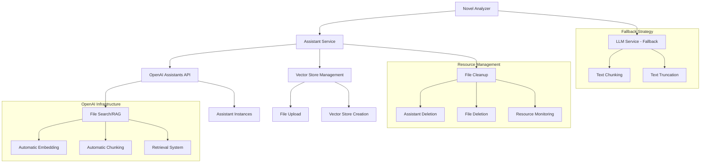

# Design Document: OpenAI Assistants API with RAG Integration

## Overview

The OpenAI Assistants API with RAG integration addresses critical token limit issues in the Novel RPG Game system by replacing direct LLM calls with OpenAI's Assistants API and File Search capabilities. This enhancement eliminates the ~4k token constraint that causes failures with large novels like Pride & Prejudice (~387k characters) by leveraging OpenAI's built-in RAG functionality, which automatically handles file chunking, embedding, and retrieval.

The design maintains backward compatibility while providing significant performance improvements: no token limits, reduced rate limiting, automatic optimization, and cost-effective processing through pay-once-upload-many-queries model.

## Architecture

The enhanced architecture introduces the Assistant Service as a new layer that interfaces with OpenAI's Assistants API, while maintaining fallback capabilities to the existing LLM Service:



## Components and Interfaces

### Assistant Service
The core service that manages OpenAI Assistants API interactions, providing RAG capabilities for large novel processing.

**Interface:**
```typescript
interface AssistantService {
  uploadNovel(novelPath: string, novelTitle: string): Promise<UploadResult>
  createAssistant(fileId: string, instructions: string): Promise<string>
  queryAssistant(assistantId: string, prompt: string): Promise<string>
  cleanupResources(assistantId: string, fileId: string): Promise<void>
  validateConfiguration(): Promise<boolean>
  getUsageMetrics(): Promise<UsageMetrics>
}

interface UploadResult {
  fileId: string
  vectorStoreId: string
  uploadSize: number
  processingStatus: 'pending' | 'completed' | 'failed'
}

interface UsageMetrics {
  filesUploaded: number
  totalStorageUsed: number
  queriesExecuted: number
  estimatedCost: number
}
```

### Enhanced Novel Analyzer
The Novel Analyzer is enhanced to intelligently choose between Assistant API and direct LLM calls based on novel size and configuration.

**Interface:**
```typescript
interface EnhancedNovelAnalyzer extends NovelAnalyzer {
  analyzeNovelWithAssistant(novelPath: string): Promise<NovelAnalysis>
  extractCharactersWithAssistant(assistantId: string): Promise<Character[]>
  extractPlotPointsWithAssistant(assistantId: string): Promise<PlotPoint[]>
  identifyNarrativeStructureWithAssistant(assistantId: string): Promise<NarrativeStructure>
  shouldUseAssistantAPI(novelSize: number): boolean
  fallbackToDirectLLM(novelPath: string): Promise<NovelAnalysis>
}

interface ProcessingStrategy {
  method: 'assistant_api' | 'direct_llm' | 'chunked_llm'
  reason: string
  estimatedTokens?: number
  fileSize: number
}
```

### Vector Store Manager
Manages OpenAI Vector Stores for efficient file organization and retrieval.

**Interface:**
```typescript
interface VectorStoreManager {
  createVectorStore(name: string, expirationDays?: number): Promise<string>
  uploadFileToVectorStore(vectorStoreId: string, filePath: string): Promise<string>
  attachVectorStoreToAssistant(assistantId: string, vectorStoreId: string): Promise<void>
  deleteVectorStore(vectorStoreId: string): Promise<void>
  getVectorStoreStatus(vectorStoreId: string): Promise<VectorStoreStatus>
}

interface VectorStoreStatus {
  id: string
  status: 'in_progress' | 'completed' | 'failed'
  fileCount: number
  sizeBytes: number
  lastActivity: Date
}
```

### Resource Cleanup Manager
Ensures proper cleanup of OpenAI resources to prevent cost accumulation.

**Interface:**
```typescript
interface ResourceCleanupManager {
  scheduleCleanup(assistantId: string, fileId: string, vectorStoreId: string): void
  executeCleanup(resourceIds: ResourceIdentifiers): Promise<CleanupResult>
  forceCleanupAll(): Promise<CleanupResult[]>
  getOrphanedResources(): Promise<OrphanedResource[]>
  validateCleanup(resourceIds: ResourceIdentifiers): Promise<boolean>
}

interface ResourceIdentifiers {
  assistantId?: string
  fileId?: string
  vectorStoreId?: string
}

interface CleanupResult {
  success: boolean
  resourcesDeleted: string[]
  errors: string[]
  costSavings: number
}

interface OrphanedResource {
  id: string
  type: 'assistant' | 'file' | 'vector_store'
  createdAt: Date
  estimatedCost: number
}
```

### Configuration Enhancement
Extended configuration to support Assistant API settings and feature flags.

**Interface:**
```typescript
interface EnhancedSystemConfig extends SystemConfig {
  assistantAPI: AssistantAPIConfig
  fallback: FallbackConfig
  resourceManagement: ResourceManagementConfig
}

interface AssistantAPIConfig {
  enabled: boolean
  model: string
  maxFileSize: number // in MB
  vectorStoreExpiration: number // in days
  autoCleanup: boolean
  usageThreshold: number // switch to fallback after this many queries
}

interface FallbackConfig {
  enableFallback: boolean
  chunkSize: number
  maxChunks: number
  truncationLimit: number
  retryAttempts: number
}

interface ResourceManagementConfig {
  cleanupInterval: number // in minutes
  maxOrphanedResources: number
  costAlertThreshold: number
  monitoringEnabled: boolean
}
```

## Data Models

### Assistant Session
Tracks the lifecycle of an Assistant API session for a novel analysis.

```typescript
interface AssistantSession {
  sessionId: string
  novelTitle: string
  novelPath: string
  assistantId: string
  fileId: string
  vectorStoreId: string
  createdAt: Date
  status: 'initializing' | 'active' | 'completed' | 'failed' | 'cleaning_up'
  queriesExecuted: number
  totalCost: number
  cleanupScheduled: boolean
}

interface QueryResult {
  sessionId: string
  query: string
  response: string
  tokensUsed: number
  responseTime: number
  timestamp: Date
  retrievedChunks?: string[]
}
```

### Processing Metrics
Tracks performance and cost metrics for both Assistant API and fallback methods.

```typescript
interface ProcessingMetrics {
  method: 'assistant_api' | 'direct_llm' | 'chunked_llm'
  novelSize: number
  processingTime: number
  tokensUsed: number
  cost: number
  success: boolean
  errorMessage?: string
  qualityScore?: number
}

interface ComparisonReport {
  novelTitle: string
  assistantAPIMetrics?: ProcessingMetrics
  fallbackMetrics?: ProcessingMetrics
  recommendation: 'assistant_api' | 'fallback' | 'either'
  reasoning: string
}
```

## Error Handling

### Assistant API Specific Errors
- **File Upload Failures**: Handle size limits, format issues, and network problems
- **Vector Store Creation Errors**: Manage quota limits and processing failures
- **Assistant Creation Failures**: Handle model availability and configuration issues
- **Query Processing Errors**: Manage timeout, rate limiting, and response parsing
- **Resource Cleanup Failures**: Ensure orphaned resources are tracked and manually cleaned

### Fallback Strategy Implementation
```typescript
interface FallbackStrategy {
  trigger: 'api_failure' | 'quota_exceeded' | 'timeout' | 'configuration_disabled'
  action: 'direct_llm' | 'chunked_processing' | 'cached_result' | 'user_notification'
  retryCount: number
  maxRetries: number
}

class FallbackHandler {
  async handleFailure(error: AssistantAPIError, context: ProcessingContext): Promise<NovelAnalysis> {
    const strategy = this.determineFallbackStrategy(error)
    
    switch (strategy.action) {
      case 'direct_llm':
        return this.fallbackToDirectLLM(context)
      case 'chunked_processing':
        return this.processInChunks(context)
      case 'cached_result':
        return this.retrieveCachedResult(context)
      case 'user_notification':
        throw new FallbackExhaustedException(error.message)
    }
  }
}
```

## Testing Strategy

The testing approach validates both the new Assistant API functionality and the fallback mechanisms, ensuring reliability across different scenarios.

### Unit Testing
- **Assistant Service**: Mock OpenAI API calls for isolated testing
- **Vector Store Management**: Test file upload, creation, and deletion operations
- **Resource Cleanup**: Validate cleanup logic and orphaned resource detection
- **Fallback Logic**: Test strategy selection and execution
- **Configuration Validation**: Test feature flag behavior and configuration parsing

### Integration Testing
- **End-to-End Assistant API Flow**: Upload novel → Create assistant → Query → Cleanup
- **Fallback Integration**: Test seamless switching between Assistant API and direct LLM
- **Resource Management**: Test cleanup scheduling and execution
- **Cost Monitoring**: Validate usage tracking and cost estimation

### Property-Based Testing
Property-based tests will validate universal properties using fast-check with a minimum of 100 iterations per test.

**Configuration:**
- **Library**: fast-check for TypeScript
- **Iterations**: Minimum 100 per property test
- **Tagging format**: `// Feature: openai-assistants-rag, Property {number}: {property_text}`

## Correctness Properties

*A property is a characteristic or behavior that should hold true across all valid executions of a system—essentially, a formal statement about what the system should do. Properties serve as the bridge between human-readable specifications and machine-verifiable correctness guarantees.*

### Property 1: Assistant Creation Workflow Completeness
*For any* novel file requiring analysis, the system should upload the file, create an assistant instance with file search capabilities, configure it with appropriate instructions, and return a unique assistant identifier.
**Validates: Requirements 1.1, 1.2, 1.3, 1.4**

### Property 2: Novel Size Processing Strategy
*For any* novel, the system should use Assistant API for novels larger than 100k characters and direct LLM calls for smaller novels, maintaining consistent output formats regardless of method.
**Validates: Requirements 2.1, 2.6, 8.1**

### Property 3: Assistant Reuse Efficiency
*For any* novel being analyzed multiple times, the system should upload the novel once and reuse the same assistant for all subsequent queries within the same session.
**Validates: Requirements 2.2**

### Property 4: Query Processing Consistency
*For any* analysis request (character extraction, plot analysis, or narrative structure), the system should use appropriate prompts and return structured responses in the expected format.
**Validates: Requirements 1.5, 1.6, 2.3, 2.4, 2.5**

### Property 5: Fallback Activation Reliability
*For any* Assistant API failure (unavailability, quota exceeded, or network issues), the system should automatically activate fallback mechanisms and log the event.
**Validates: Requirements 3.1, 3.3, 3.4, 3.5**

### Property 6: Fallback Processing Strategy
*For any* fallback scenario with large novels, the system should use appropriate text chunking or truncation strategies and notify users of reduced functionality.
**Validates: Requirements 3.2, 3.6**

### Property 7: Resource Cleanup Completeness
*For any* completed or failed analysis session, the system should delete the assistant instance, remove uploaded files, and handle cleanup even during error conditions.
**Validates: Requirements 4.1, 4.2, 4.3**

### Property 8: Concurrent Session Independence
*For any* set of concurrent analysis sessions, each session should track and clean up its resources independently without interference.
**Validates: Requirements 4.4**

### Property 9: Retry Logic Implementation
*For any* API failure, the system should implement exponential backoff retry logic and queue requests when rate limits are encountered.
**Validates: Requirements 5.4, 5.5**

### Property 10: Progress Indication
*For any* long-running Assistant API operation, the system should provide progress indicators to users.
**Validates: Requirements 5.6**

### Property 11: Configuration-Driven Behavior
*For any* configuration setting (API key, model, feature flags), the system should use the configured values and validate them on startup.
**Validates: Requirements 6.1, 6.2, 6.3, 6.5**

### Property 12: Feature Flag Enforcement
*For any* configuration where Assistant API is disabled, the system should use only the fallback LLM service.
**Validates: Requirements 6.4**

### Property 13: Error Response Quality
*For any* system error (API failures, upload failures, creation failures), the system should log detailed information and provide specific guidance to users.
**Validates: Requirements 7.1, 7.2, 7.3**

### Property 14: Usage Metrics Tracking
*For any* Assistant API operation, the system should track and report usage metrics including uploads, queries, and costs.
**Validates: Requirements 7.4**

### Property 15: Proactive Monitoring
*For any* quota usage approaching limits, the system should warn administrators before hitting the limits.
**Validates: Requirements 7.5**

### Property 16: Diagnostic Capability
*For any* system deployment, diagnostic commands should be available to test Assistant API connectivity and configuration.
**Validates: Requirements 7.6**

### Property 17: Processing Method Equivalence
*For any* novel processed by both Assistant API and fallback methods, the analysis results should be equivalent in structure and content quality.
**Validates: Requirements 8.2, 8.4**

### Property 18: Interface Consistency
*For any* processing method used, the command-line interface and user experience should remain identical.
**Validates: Requirements 8.3**

### Property 19: Format Compatibility Preservation
*For any* existing novel format or file type, the system should continue to support it without modification.
**Validates: Requirements 8.5**

### Property 20: Test Suite Compatibility
*For any* existing automated test, it should pass regardless of which processing method is used.
**Validates: Requirements 8.6**

### Property 21: Manual Cleanup Availability
*For any* orphaned resources in the system, manual cleanup commands should be available and functional.
**Validates: Requirements 4.5, 4.6**

## Implementation Strategy

### Phase 1: Core Assistant Service Implementation
1. **Assistant Service Foundation**: Implement basic upload, creation, and query functionality
2. **Vector Store Management**: Add vector store creation and file attachment capabilities
3. **Basic Error Handling**: Implement fundamental error handling and logging

### Phase 2: Integration and Fallback
1. **Novel Analyzer Enhancement**: Integrate Assistant Service with existing Novel Analyzer
2. **Fallback Strategy**: Implement comprehensive fallback mechanisms
3. **Configuration Integration**: Add feature flags and configuration validation

### Phase 3: Resource Management and Monitoring
1. **Cleanup Implementation**: Add automatic and manual resource cleanup
2. **Usage Tracking**: Implement metrics collection and reporting
3. **Monitoring and Alerts**: Add proactive monitoring and quota warnings

### Phase 4: Testing and Optimization
1. **Comprehensive Testing**: Implement all property-based and unit tests
2. **Performance Validation**: Verify performance improvements over direct LLM calls
3. **Backward Compatibility**: Ensure all existing functionality remains intact

## Cost Considerations

### OpenAI Assistants API Pricing
- **File Storage**: $0.10/GB/day (first 1GB free)
- **Vector Store Operations**: No additional cost beyond storage
- **Query Processing**: Standard GPT-4 pricing per token
- **File Upload**: One-time cost, reusable for multiple queries

### Cost Optimization Strategies
- **Automatic Cleanup**: Prevent accumulation of storage costs
- **Smart Caching**: Reuse assistants for similar novels
- **Size-Based Strategy**: Use direct LLM for small novels to avoid storage costs
- **Monitoring**: Track usage and costs proactively

## Security Considerations

### Data Privacy
- **Novel Content**: Uploaded to OpenAI servers, subject to OpenAI's data policies
- **Retention**: Files automatically deleted after analysis completion
- **Access Control**: Assistant instances are private to the API key owner

### API Security
- **Key Management**: Secure storage and rotation of OpenAI API keys
- **Rate Limiting**: Built-in protection against abuse
- **Error Handling**: Prevent sensitive information leakage in error messages

## Migration Strategy

### Gradual Rollout
1. **Feature Flag**: Deploy with Assistant API disabled by default
2. **Small Novel Testing**: Enable for novels under 200k characters first
3. **Large Novel Migration**: Gradually enable for larger novels
4. **Full Deployment**: Enable by default after validation

### Rollback Plan
- **Immediate Fallback**: Disable feature flag to revert to direct LLM calls
- **Data Preservation**: Ensure no data loss during rollback
- **Performance Monitoring**: Track metrics to validate improvements

This design provides a comprehensive solution for handling large novels while maintaining system reliability and backward compatibility. The Assistant API integration eliminates token limits while providing better performance and cost efficiency for the Novel RPG Game system.